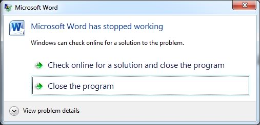
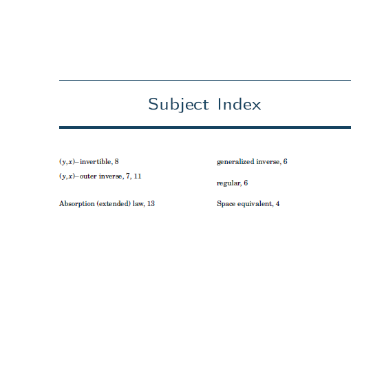

---
title: "LaTeX"
author: "David Raj Micheal"
subtitle: "A Perfect way to be Perfect"
output: 
  ioslides_presentation:
    css: style.css
  
--- 


## How many of you got the following experiances?  {.flexbox .vcenter}
<div class="centered">
 
 
</div>


## How many of you got the following experiances? {.flexbox .vcenter}
<div class="centered">


</div>


## How often you think of these questions? 

> - Is the likelihood of a crash is directly proportional to the importance of a document?
   
> - Is the likelihood of a crash is inversely proportional to the time left before its deadline.

> - Is the likelihood of a crash is directly proportional to the duration since you last saved the doucument?

> - Is the likelihood of you throwing your computer out of the window is directly proportional to the number of times you get a message 
<div class="centered">
"The file cannot be opened" ?
</div>
 

## Are you tired?  {.flexbox .vcenter}

These problems can occur when you use more graphics and complex scripts running behind the program.

> - Have you any time typed a document of more than 1000 pages? 

> - What if a software or program get you out off all these issues? 


## What we need?  

> - A neat document when you write a report. 

> - When you are writing the content, there should not be any deviation such as formatting the document.

> - An automatted numbering system for chapter and section headings. 

> - Excellent bibliography management.

> - Even if we go for 100000000 pages document, this **should not** be painful. 


## Revolutionists in the type setting world {.flexbox .vcenter}
<div class="columns-2">
  >- Donald Ervin Knuth (1938)
  >- American computer scientist, mathematician 
  >- Professor emeritus at Stanford University.

   
</div>


## Revolutionists in the type setting world {.flexbox .vcenter}

<div class="columns-2">
  > - In 1978, he created a typesetting system, called Tex (pronounced 'tech'). 
  > - Tex gave extremely fine-grained control of document layout.
  > - However, the vast flexibility meant it was complex.
  
 
</div>
  


## Revolutionists in the type setting world 

<div class="columns-2">
  >- Leslie Lamport
  >- February 7, 1941
  >- American computer scientist 
  >- Microsoft Research in Mountain View, California.
  >- In 1983,  created a set of macros that abstracted away many of the complexities of TeX.
  
   
</div> 


## What is a $\LaTeX$?

>- LaTeX is essentially a markup language.
>- Content is written in plain text 
>- Content and the format of the doucument is separated. 
>- The LaTeX interpreter reads in a LaTeX marked-up file, renders the content into a document and dumps it a new file.


## Separation of content and style
<div class="column-2">

>-  When producing your LaTeX document, you are concentrating on the content itself. 
>- No deviation from your content.

 
 

</div>


## Portability

>- An actual LaTeX file is merely a text file, which is just about the most portable format in computing. 
>- Your data will never be corrupted or missed unless you delete the file itself.

>- Standard output is dvi file which stands for device independent. 


## Flexibility

> - You can get LaTeX to do just about anything you can think of! 

> - There are other crazy packages that you can install which allow you to typeset music scores, chessboards and cross-words!

> -  If you're struggling to do a task, someone will have undoubtedly written a package to solve it easily! 


## Control

> - LaTeX is much more clever in  positioning your images and tables with a lot of common sense.
>- Unlike word processors, it has a high floating sense to place these objects. 

>- You can have total control over the presentation of your document.


## Quality {.flexbox .vcenter .hcenter}

<div class = "column-2">
> - It's difficult to disagree that the output from LaTeX is far superior to what Word can produce.

> - High mathematical content, takes the LaTeX to high in quality.

> - Its algorithms for laying out text are more sophisticated and extremely fine-grained. 
<div class="centered">
 
</div>
</div>


## Scalability

<div class = "column-2">
 - In my personal experience, using Word for documents with more than 20 pages has not been a pleasant experience. 

 - You are free to split up large documents into smaller chunks and then let LaTeX combine them altogether later (like one chapter per file). 

 -  It can also create tables of content, indexes and bibliographies easily, even on multi-file projects.
 
<div class="centered">
 
</div> 

</div>


## Stability {.centered}

<div class ="column-2">

 There is no risk of you ever losing your original source text.

 

</div>


## No bounds for the usage. 

 - LaTeX can be used as back end for many programming languages such as R, Python, matlab, mathematica, to prepare the report. For example, 

```{r, cache=FALSE, message=FALSE, results='hide'}
library(stargazer)
stargazer(mtcars)
```
 gives the latex code for the table which consists of mtcars data set. 
 


## The output {.centered}

 


## Mind map using LaTeX and tikz {.centered}


 


## Reproducible Graphs {.centered}


## Cost {.centered}

<div style="font-size:200%; font-weight: bold; color:red; text-align: center; border: 3px solid green;"> "You get what you pay for" fails here...!!!


</div>

 

## What are we going to do in this sequence of tutorials?

<div style="font-size:200%; font-weight: bold; color:red; text-align: center; border: 3px solid green;"> 
 Build a template for your thesis from the scratch. Thats all!!!

</div>


##  {.vcenter}

<div style="font-size:200%; font-weight: bold; color:red; text-align: center; border: 3px solid green;"> 
 Final output will be...

</div>


## Title page and table of contents {.centered}


## Chapters may look like... {.centered}


## Contents pages... {.centered}


## Appendices & Bibliography... {.centered}


## Subject Index... {.centered}





##  {.centered}


